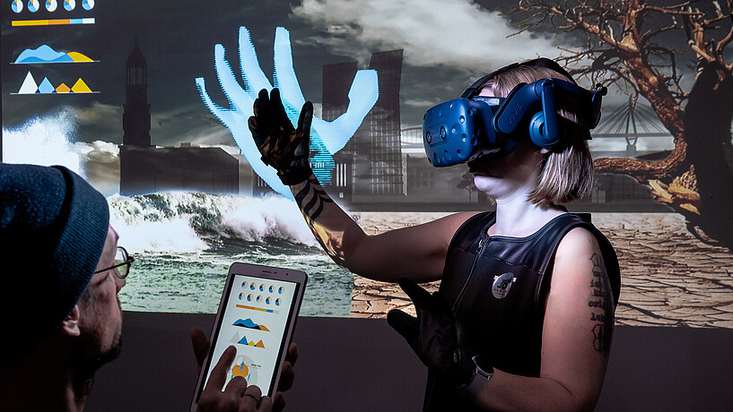
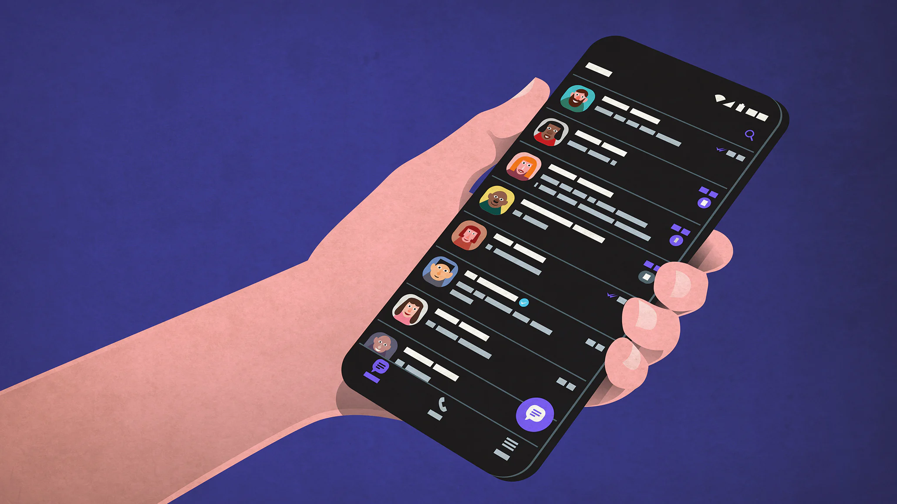

import imageMarvhuel from '@/images/team/IMG_2239.jpeg'

export const article = {
  date: '2023-08-01',
  title: 'Die Zukunft des Webdesigns in 2023',
  description:
    'Willkommen im Jahr 2023! Die Welt des Webdesigns hat in den letzten Jahren eine rasante Entwicklung durchgemacht, und auch dieses Jahr bringt aufregende Trends und Technologien hervor, die das digitale Erlebnis revolutionieren. In diesem Blogbeitrag werfen wir einen Blick auf die spannendsten Entwicklungen und zeigen Ihnen, wie Webdesign in 2023 Ihre Online-Präsenz auf ein neues Level heben kann.',
  author: {
    name: 'Marvin Hülsmann',
    role: 'CEO von MHCreations',
    image: { src: imageMarvhuel },
  },
}

export const metadata = {
  title: article.title,
  description: article.description,
}

Willkommen im Jahr 2023! Die Welt des Webdesigns hat in den letzten Jahren eine rasante Entwicklung durchgemacht, und auch dieses Jahr bringt aufregende Trends und Technologien hervor, die das digitale Erlebnis revolutionieren. In diesem Blogbeitrag werfen wir einen Blick auf die spannendsten Entwicklungen und zeigen Ihnen, wie Webdesign in 2023 Ihre Online-Präsenz auf ein neues Level heben kann.

## 1. Immersive User Experience

In 2023 geht es beim Webdesign nicht mehr nur um das statische Betrachten von Inhalten. Mit immer leistungsfähigeren Geräten und Technologien wird das Webdesign zunehmend immersiv. Virtual Reality (VR) und Augmented Reality (AR) werden in Webseiten integriert, um den Nutzern ein beeindruckendes und interaktives Erlebnis zu bieten. Egal, ob es sich um virtuelle Showrooms, 360-Grad-Touren oder AR-Produktdemonstrationen handelt - Ihre Webseite wird die Besucher in den Bann ziehen.

## 2. Personalisierte User Interfaces

In der heutigen datengetriebenen Welt erwarten Benutzer personalisierte Erfahrungen. Webseiten werden sich an die individuellen Vorlieben, demografischen Merkmale und Verhaltensmuster der Nutzer anpassen. Durch künstliche Intelligenz (KI) und maschinelles Lernen können Webseiten dynamisch Inhalte und Designs generieren, die auf jeden Besucher zugeschnitten sind. Das Ergebnis? Höhere Nutzerzufriedenheit und verbesserte Conversion-Raten.

## 3. Voice User Interfaces (VUI):

Die Popularität von Sprachassistenten und smarten Lautsprechern steigt weiterhin an, und 2023 wird die Implementierung von Voice User Interfaces in Webdesigns zu einem wichtigen Trend. Durch VUI können Benutzer per Sprachbefehl mit Ihrer Webseite interagieren, Suchanfragen stellen und Aktionen ausführen. Es ist an der Zeit, Ihre Webseite sprachgesteuert zu machen und so eine nahtlose und intuitive Nutzererfahrung zu bieten.

## 4. Dark Mode Design

Der Dark Mode hat sich als beliebter Trend etabliert und wird auch in 2023 nicht an Bedeutung verlieren. Nicht nur spart der Dark Mode Energie auf mobilen Geräten, sondern er verleiht auch Webseiten ein modernes und stilvolles Aussehen. Mit einem gut gestalteten Dark Mode können Sie die Aufmerksamkeit auf Ihre Inhalte lenken und das Lesen bei schwachem Licht angenehmer gestalten.

## 5. Inklusives Webdesign

Die Barrierefreiheit wird zu einem zentralen Anliegen in der Webdesign-Community. Im Jahr 2023 werden Webseiten verstärkt darauf ausgerichtet sein, dass sie für Menschen mit Behinderungen zugänglich sind. Die Einhaltung von Web Content Accessibility Guidelines (WCAG) wird immer wichtiger, um eine breitere Zielgruppe zu erreichen und die Nutzererfahrung für alle zu verbessern.

**Fazit**

Das Webdesign in 2023 wird von Innovationen und kreativen Ansätzen geprägt sein. Als Unternehmen sollten Sie diese neuen Trends und Technologien nutzen, um eine herausragende Online-Präsenz zu schaffen und Ihre Besucher zu begeistern. Immersive Erlebnisse, Personalisierung, Sprachsteuerung, Dark Mode und Barrierefreiheit sind nur einige der Aspekte, die den Unterschied ausmachen und Ihre Webseite zum Erfolg führen können. Bleiben Sie neugierig, experimentieren Sie und gestalten Sie die Zukunft des Webdesigns aktiv mit!
